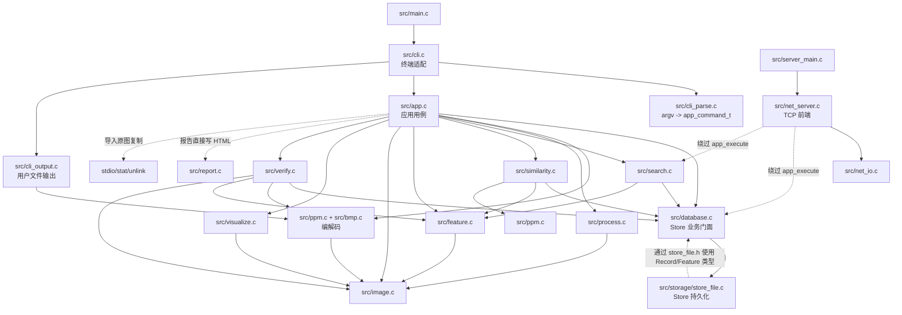
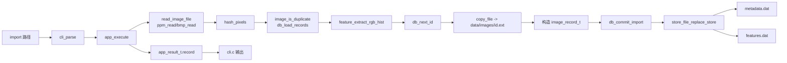

# C-ImageDB 架构说明

本文描述当前工作区中的真实实现。发生冲突时，以 `Makefile`、`include/`、`src/` 和 `tests/` 中的代码为准，而不是历史文档中的旧文件职责或旧行号。

## 1. 项目目标与边界

C-ImageDB 是一个 C11 编写的本地图像管理、处理与颜色直方图检索工具。它有三个可执行文件：

- `imagedb`：主要 CLI，由 `src/main.c` 进入。
- `cimagedb`：与 `imagedb` 链接同一组源文件，保留兼容入口。
- `imagedb-server`：可选的串行 TCP 查询服务，由 `src/server_main.c` 进入。

当前实现支持 PPM P6 和未压缩 24-bit BI_RGB BMP；内存中统一使用 `image_t` 的三通道 RGB 数据。它使用本地目录和原生 C 结构体数组保存 Store，不是通用数据库，也不提供事务并发、跨平台磁盘 ABI 或语义图像检索。

## 2. 模块职责

| 层/模块 | 真实职责 | 主要文件 |
| --- | --- | --- |
| CLI 入口与编排 | 调用解析器、应用服务和输出适配器；保留现有 stdout/stderr 文本与退出码 | `src/main.c`、`src/cli.c`、`include/cli.h` |
| CLI 参数解析 | 把 `argv` 转成 `app_command_t`；返回结构化 `cli_parse_error_t`，不执行业务或文件 I/O | `src/cli_parse.c`、`src/cli_parse.h` |
| CLI 输出 | 把 `app_result_t` 格式化到终端；把图像/CSV 写到用户给定路径，CSV 使用临时文件替换，图像由 codec 直接写目标 | `src/cli.c`、`src/cli_output.c`、`src/cli_output.h` |
| 应用/核心用例 | 按 `app_command_kind_t` 分发命令，组合 Store、编解码、处理、检索、校验和报告模块，返回 `app_status_t` 与 `app_result_t` | `include/app.h`、`src/app.c` |
| Store 业务门面 | 查找、逻辑删除、导入成对提交、compact；不直接持有 `FILE *` | `include/database.h`、`src/database.c` |
| Store 文件持久化 | Store 目录和路径、`.next_id`、原生数组读写、临时文件替换、双文件回滚 | `src/storage/store_file.h`、`src/storage/store_file.c` |
| 图像内存模型 | 创建、克隆、校验和释放 `image_t` | `include/image.h`、`src/image.c` |
| 图像编解码 | PPM P6 和 24-bit BMP 的文件读写 | `include/ppm.h`、`src/ppm.c`、`include/bmp.h`、`src/bmp.c` |
| 图像处理 | 接受只读源图像，返回新分配的处理结果 | `include/process.h`、`src/process.c` |
| 特征 | 提取 `image_feature_t`，计算 L1、L2 和 histogram intersection | `include/feature.h`、`src/feature.c` |
| Store 内检索 | 以已有 Record ID 为查询，支持三种度量并返回 `search_result_t[]` | `include/search.h`、`src/search.c` |
| 外部图检索 | 读取外部 PPM，现场提取特征并做 L1 Top-K | `include/similarity.h`、`src/similarity.c` |
| 一致性检查/修复 | 检查 Record、Feature 和图像文件，修复可恢复问题 | `include/verify.h`、`src/verify.c` |
| 可视化 | 在内存中生成直方图图像和 contact sheet | `include/visualize.h`、`src/visualize.c` |
| HTML 报告 | 读取输出目录中的 CSV，以 `stat()` 确认候选图像存在并生成引用这些文件的 HTML | `include/report.h`、`src/report.c` |
| TCP 前端 | 解析行协议、执行 LIST/INFO/SEARCH/QUIT、组织协议文本 | `src/server_main.c`、`src/net_server.c`、`include/net_server.h` |
| TCP 发送 | 处理短写和 `EINTR`；回调版本便于单测 | `src/net_io.c`、`include/net_io.h` |

这里没有独立的 `index` 模块：所谓检索“索引”就是持久化的 `image_feature_t[]`，检索时由 `search_similar()` 或 `similarity_search_ppm()` 线性扫描。也没有独立的 `query` 目录：字段/操作符模型在 `include/app.h`，过滤实现在 `src/app.c` 的 `execute_query()`。

## 3. 当前模块依赖图

实线表示主要允许方向；虚线表示当前仍存在、需要维护者知情的边界例外。



### 3.1 依赖方向约束

维护时应保持以下方向：

1. `main.c` 只进入前端编排函数，不承载业务。
2. `cli_parse.c` 可以依赖 `app.h` 的命令模型，但不能依赖 `database.h`、Store 或图像文件 I/O。
3. `cli.c` 负责用户可见文本和退出码；`app.c` 不应调用 `printf()`、读取 stdin/stdout 或解析 `argv`。
4. `app.c` 组合用例；数据持久化规则应经 `database.c`，Store 元数据的 `FILE *` 操作应只在 `store_file.c`。
5. 函数调用方向是 `database.c` → 内部 `store_file.h/.c`；但 `store_file.h` 当前包含 `database.h` 以取得 `image_record_t`/`image_feature_t`，形成反向的编译期类型依赖。Storage 不应再反向调用任何 `db_*()`，也不应依赖 `app.c`、CLI、检索或网络。
6. `process.c`、`feature.c`、`visualize.c` 应围绕 `image_t` 工作，不依赖 CLI、Store 路径或网络。
7. 公共接口放在 `include/`；仅模块内部使用的 `cli_parse.h`、`cli_output.h`、`store_file.h` 保持在 `src/`。
8. TCP 协议文本属于 `net_server.c`，不能泄漏到 Store 或检索模块。

当前显式例外是：`net_server.c` 直接依赖 `database.c/search.c`，`app.c::copy_file()` 直接复制导入原图，以及 Storage 对 Database 数据类型的反向编译期依赖。它们是现状，不应在无协议、磁盘格式或行为基线的普通修改中顺手迁移。

## 4. 核心数据模型

### 4.1 内存图像

`include/image.h` 定义：

```c
typedef struct image {
    int width;
    int height;
    int channels;
    unsigned char *data;
} image_t;
```

`image_create()` 同时分配结构体和像素缓冲区，`image_destroy()` 同时释放两者。`ppm_read()`、`bmp_read()` 和所有 `process_*()` 返回的 `image_t *` 都由调用者持有。

### 4.2 Record

`include/database.h` 的 `image_record_t` 保存 ID、名称、Store 内路径、尺寸、通道数、文件大小、导入时间、像素哈希和逻辑删除标记。`deleted != 0` 的记录仍在 `metadata.dat`，直到 `db_compact()` 过滤。

### 4.3 Feature

`include/feature.h` 的 `image_feature_t` 保存 `image_id`、R/G/B 各 256 个整型 bin，以及三个平均通道值。`feature_extract_rgb_hist()` 从三通道 RGB 图像生成该结构。

### 4.4 应用命令与结果

`include/app.h` 是 CLI 与核心用例之间的边界：

- `app_command_t` 是带 `app_command_kind_t` 标签的参数联合体；其中字符串指针在一次调用期间是借用值。
- `app_context_t.data_dir` 是借用的 Store 路径。
- `app_execute()` 初始化 `app_result_t`，成功时可能把数组或 `image_t` 的所有权交给结果。
- `app_result_destroy()` 根据 `result->kind` 释放 Record 列表、检索结果或图像。

## 5. 磁盘布局与兼容格式

`store_file_init()` 当前创建或探测以下布局：

```text
data/
  .next_id       十进制文本，例如 "3\n"
  metadata.dat   image_record_t 的原生内存布局顺序数组
  features.dat   image_feature_t 的原生内存布局顺序数组
  images/
    <id>.ppm 或 <id>.bmp   导入文件的原始字节副本
output/          store_file_init() 还会在当前工作目录创建该目录
```

临时/恢复文件为 `.next_id.tmp`、`metadata.tmp`、`features.tmp`、`metadata.bak` 和 `features.bak`。

磁盘格式的关键事实：

- `metadata.dat` 与 `features.dat` 没有文件头、版本号或显式字节序。
- `store_file_load_records()` 和 `store_file_load_features()` 要求文件大小分别能被 `sizeof(image_record_t)` 和 `sizeof(image_feature_t)` 整除。
- 这些文件包含编译器 ABI 的 padding、宿主字节序和 `long` 宽度；现有 `storage-v1-lp64` fixture 只锁定当前 LP64 兼容路径，不代表跨 ABI 可移植。
- `store_file_replace_store()` 先写两个 tmp，再把旧文件改名为 bak，安装两个新文件，运行时失败时尝试回滚。两个 POSIX `rename()` 之间的进程崩溃窗口仍存在，且没有 `fsync()` 保证断电持久性。
- `db_next_id()` 在导入复制和提交之前推进 `.next_id`，所以失败导入可能留下 ID 空洞；这是现有行为。

## 6. 主要数据流

### 6.1 导入



### 6.2 已有图像处理

`app.c::execute_image_process()` 先用 `db_find_record_by_id()` 得到 Store 路径，再由 `read_image_file()` 解码，调用一个 `process_*()` 产生新 `image_t`。源图像在 `app.c` 中释放；结果图像由 `app_result_t` 持有。`cli.c::write_processed_image()` 再调用 `cli_output_write_image()` 按输出扩展名选择 `ppm_write()` 或 `bmp_write()`，最后 `app_result_destroy()` 释放结果。

### 6.3 检索

- `search`：`app.c::execute_search()` → `search_similar()`；查询对象是 Store 中已有 ID，支持 L1、L2、intersection。
- `search-similar`：`app.c::execute_similarity()` → `similarity_search_ppm()`；查询对象是外部 PPM，只使用 L1。
- `search-export`：核心返回 `app_search_export_item_t[]`，CLI 用 `cli_output_write_search()` 写 CSV。
- `search-contact`：核心读取查询图和命中图、生成 128×128 缩略图并调用 `visualize_contact_sheet()`；CLI 只写最终图像。

两条检索都在调用时全量加载数组，没有常驻内存索引。

### 6.4 TCP 查询

`net_server_run()` 接受一个客户端后，`process_bytes()` 按换行组帧并处理 CRLF、NUL 和超长行；`process_line()` 解析 LIST/INFO/SEARCH/QUIT。三个查询 handler 直接调用 `db_load_records()`、`db_find_record_by_id()` 或 `search_similar()`，再通过 `net_send_all()` 输出协议文本。服务一次只处理一个客户端。

## 7. 关键设计决策

### 7.1 保持 C 风格的显式所有权

公共接口使用返回码、输出参数和显式 `free()`/`image_destroy()`；没有引入对象系统。应用结果通过 `app_result_destroy()` 统一销毁，是当前最重要的所有权边界。

### 7.2 CLI 只拥有呈现行为

`cli_parse()` 不执行业务，`app_execute()` 不输出终端文本，`cli.c` 保留历史文本和 0/1 退出行为。这使 `tests/test_app.c` 可以在不启动 CLI 的情况下调用核心用例。

### 7.3 Store 业务规则与文件 I/O 分层

`database.c` 决定“加载、修改、成对替换”等业务步骤；`store_file.c` 决定路径、原生数组序列化、文件生命周期和回滚。这是浅层文件 Store 的有意边界，不应再添加无实际价值的 repository/object 抽象。

### 7.4 输出文件不属于 Store 持久化

Store 元数据由 `store_file.c` 管理；PPM/BMP 编解码由 codec 管理；用户请求的 CSV/图像由 `cli_output.c` 管理；HTML 由 `report.c` 管理。把所有 `FILE *` 一概塞进 Store 模块会混淆“Store 内部文件”和“用户产物”。

## 8. 已知文档和用户文本冲突

`README.md` 的模块目录和单元测试清单已经与当前拆分同步。以下历史设计材料或既有用户文本仍与代码存在差异，维护时不要按旧描述推断：

1. `cli_print_help()` 的导入说明仍写 `Import a PPM image`，但 `app.c::read_image_file()` 按 `.bmp` 扩展名调用 `bmp_read()`，其余路径调用 `ppm_read()`；这是既有用户文本与实际能力的不一致，本文只记录、不修改。
2. `docs/design.md` 对 compact 的说明只写 tmp + rename；当前 `store_file_replace_store()` 还使用两个 `.bak` 做运行时回滚。
3. `docs/LEARNING_PLAN.md`、`docs/STUDY_GUIDE.md` 和 `docs/project_interview_notes.md` 中部分函数名、文件职责和行号来自拆分前实现；应只作为历史学习材料，调用链必须回到当前代码核对。
