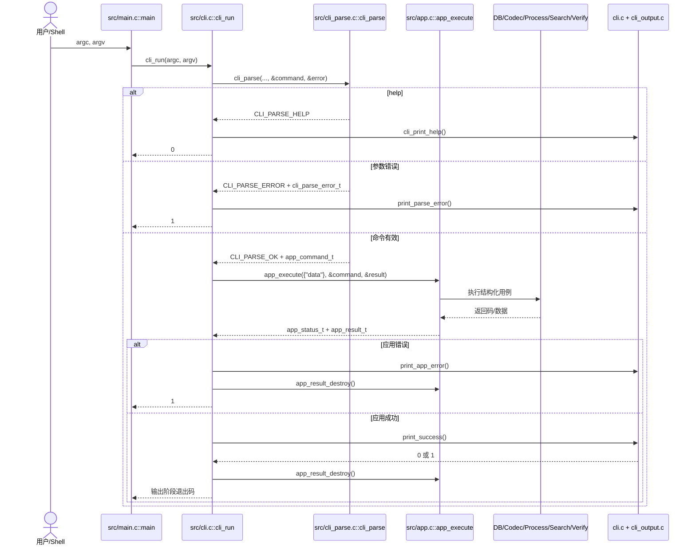
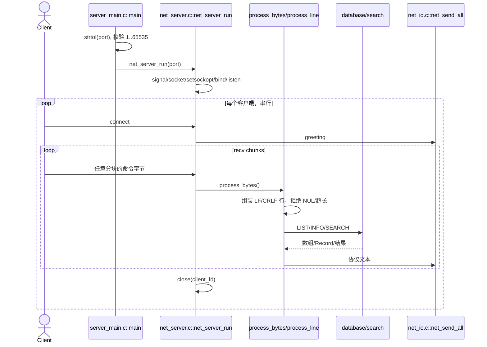

# C-ImageDB 代码走读

本文从两个真实入口开始，跟踪命令解析、核心用例、Store、图像与网络路径，并明确每一步的资源所有权和错误传播。

## 1. CLI 总流程



### 1.1 `src/main.c::main()`

`main()` 只有一行有效逻辑：返回 `cli_run(argc, argv)`。它不认识任何命令、不打开文件，也不决定错误文本。

### 1.2 `src/cli.c::cli_run()`

`cli_run()` 创建 `const app_context_t context = {DATA_DIR}`；`DATA_DIR` 当前是字面量 `"data"`。随后：

1. 调用 `cli_parse()`。
2. 对 `CLI_PARSE_HELP` 调用 `cli_print_help()` 并返回 0。
3. 对 `CLI_PARSE_ERROR` 调用 `print_parse_error()` 并返回 1。
4. 对有效命令调用 `app_execute()`。
5. 对失败的 `app_status_t` 调用 `print_app_error()`，销毁结果并返回 1。
6. 对成功结果调用 `print_success()`；该函数可能只打印，也可能调用 `cli_output_write_*()` 生成文件。
7. 无论成功输出还是应用失败，都在返回前调用 `app_result_destroy()`。

这里的退出码不是简单等同于 `APP_STATUS_OK`：例如 `verify`/`repair` 的应用调用可以成功完成检查，但 `print_success()` 会根据仍存在的问题返回 1；用户文件写出失败也在输出阶段转成 1。

### 1.3 `src/cli_parse.c::cli_parse()`

解析器先清零 `app_command_t` 和 `cli_parse_error_t`，然后把字符串参数转换成类型化字段：

- `parse_positive_int()` 解析 ID 和 Top-K。
- `parse_int_range()` 限制 threshold 和 angle 等范围。
- `parse_metric()` 产生 `METRIC_L1`、`METRIC_L2` 或 `METRIC_INTERSECTION`。
- `parse_query_field()`、`parse_query_operator()` 与 `query_field_operator_valid()` 约束 query 组合。
- `parse_id_output()` 和 `parse_search_output()` 复用常见参数形态。

`app_command_t` 内的路径、关键字等 `const char *` 直接借用 `argv`；解析器不复制和释放这些字符串。`fail()` 只填充结构化错误，不打印。

## 2. 应用分发

`src/app.c::app_execute()` 总是先清零有效的 `app_result_t`，再按 `app_command_kind_t` 分发：

| 命令组 | 主要执行函数/模块 | 返回载荷 |
| --- | --- | --- |
| `init` | `db_init()` | 无 |
| `import` | `execute_import()` | `image_record_t` |
| `list`、`export` | `load_records()` | `app_record_list_t` |
| `info` | `execute_record_lookup()` | `image_record_t` |
| `delete` | `execute_delete()` | 被删除前的 `image_record_t` |
| `gray`/`binary`/`blur`/`edge`/`resize`/`rotate`/`equalize`/`median`/`gaussian`/`adjust`/`resize-bilinear` | `execute_image_process()` | `app_image_result_t` |
| `hist`、`hist-export` | `execute_histogram()` | Record + Feature |
| `search` | `execute_search()` | `search_result_t[]` |
| `search-similar` | `execute_similarity()` | `similar_image_result_t[]` |
| `find-name` | `filter_by_name()` | 过滤后的 Record 数组 |
| `query` | `execute_query()` | 过滤后的 Record 数组 |
| `stats` | `execute_stats()` | `app_stats_result_t` |
| `compact` | `execute_compact()` | before/after 数量 |
| `report` | `generate_html_report_status()` | `auxiliary_status` 保存报告状态 |
| `verify`/`repair` | `verify_database()`/`repair_database()` | summary 结构体 |
| `hist-image` | `execute_histogram_image()` | 新建的直方图 `image_t` |
| `search-export` | `execute_search_export()` | 结果及每条 Record 路径 |
| `search-contact` | `execute_contact_sheet()` | 新建的 contact sheet `image_t` |

`APP_COMMAND_HELP` 不应到达这里；若到达则返回 `APP_STATUS_INVALID_ARGUMENT`。

## 3. 导入路径逐步走读

入口是 `src/app.c::execute_import()`。

```mermaid
sequenceDiagram
    participant App as execute_import
    participant Codec as ppm_read/bmp_read
    participant DB as database.c
    participant Store as store_file.c
    participant FS as data/images

    App->>Codec: read_image_file(input)
    Codec-->>App: owned image_t*
    App->>App: hash_pixels(image->data)
    App->>DB: db_load_records()
    DB->>Store: store_file_load_records()
    Store-->>App: allocated Record[]
    App->>App: image_is_duplicate(); free(records)
    App->>App: feature_extract_rgb_hist(image, 0, &feature)
    App->>DB: db_next_id()
    DB->>Store: store_file_next_id()
    Store->>Store: .next_id.tmp -> .next_id
    App->>FS: copy_file(input, data/images/id.ext)
    App->>App: 构造 image_record_t
    App->>DB: db_commit_import(record, feature)
    DB->>Store: load records + features
    Store-->>DB: 两个 owned 数组
    DB->>Store: store_file_replace_store(扩展后的数组)
    Store->>Store: 写 tmp、旧文件转 bak、安装、清理
    DB-->>App: 0/-1
    alt 提交失败
        App->>FS: unlink(已复制图像)
    end
    App->>App: image_destroy(image)
```

具体步骤和副作用：

1. `read_image_file()` 只在扩展名为 `.bmp`（不区分大小写）时走 `bmp_read()`，其余都尝试 `ppm_read()`。
2. codec 返回新 `image_t`；之后所有失败分支都由 `execute_import()` 调用 `image_destroy()`。
3. `hash_pixels()` 对解码后的 RGB 像素做 djb2 风格哈希，所以去重基于像素内容，不是源文件字节。
4. `image_is_duplicate()` 全量加载 Record，忽略已逻辑删除的记录，比较 `content_hash`，然后释放数组。加载失败当前被当成“没有重复”，这是既有语义。
5. `feature_extract_rgb_hist()` 先以 ID 0 生成 Feature；分配 ID 后覆盖 `feature.image_id`。
6. `db_next_id()` 调用 `store_file_next_id()` 读取 `.next_id`，把下一个值写入 `.next_id.tmp` 并 rename。这个副作用早于图像复制和 Store 提交，因此后续失败不会回退 ID。
7. `copy_file()` 用 `"wbx"` 防止覆盖既有目标，目标是 `data/images/<id>.bmp|.ppm`。写入、读入或关闭失败时删除不完整目标。
8. `db_commit_import()` 分别加载 Record 和 Feature，扩容后调用 `db_replace_store()`，最终进入 `store_file_replace_store()`。
9. 双文件提交失败时，`execute_import()` 删除刚复制的图像；成功时把 Record 按值写入 `app_result_t`。

## 4. Store 生命周期

### 4.1 初始化

`db_init()` 只是 `store_file_init()` 的门面。后者创建/确认 `data/`、`data/images/` 和当前工作目录的 `output/`，并以 probe-or-create 方式处理 `.next_id`、`metadata.dat`、`features.dat`。已有可读文件不被覆盖。

### 4.2 读取

`store_file_load_records()`/`store_file_load_features()` 通过内部 `read_array()`：

1. `fopen(..., "rb")`；
2. `fseek()`/`ftell()` 得到文件大小；
3. 校验大小是结构体大小的整数倍且数量不超过 `INT_MAX`；
4. 一次 `malloc()` 和 `fread()`；
5. 成功关闭后把数组交给调用者。

空文件成功返回 `NULL/0`。失败时输出参数保持或重置为 `NULL/0`。Record 读取后还会由 `records_are_safe()` 检查字符串终止和 Store 本地路径，避免持久化的 `record.path` 指向目录外。

### 4.3 单文件替换

`store_file_replace_records()` 和 `store_file_replace_features()` 先把完整数组写到 tmp，`finish_write()` 负责 `fflush()` + `fclose()`，再 `rename()` 覆盖目标。输入数组只在调用期间借用。

### 4.4 成对替换

`store_file_replace_store()` 的顺序是：写两个 tmp → 两个旧文件分别改名为 bak → 安装 metadata tmp → 安装 features tmp → 删除 bak。`rollback:` 尝试删除已安装的新文件并把 bak 改回原名。若回滚自身失败，bak 会保留作为可恢复原件。

这保证常见运行时错误尽量恢复，但没有文件锁、目录 `fsync()` 或进程崩溃日志，不能当成完整事务系统。

## 5. 图像处理路径

`execute_image_process()` 先从不同 union 字段取出 ID，并验证命令特定参数。随后：

1. `db_find_record_by_id()` 返回活动 Record；该函数会全量加载、查找并释放 Record 数组。
2. `read_image_file(record.path)` 创建源 `image_t`。
3. 按 command kind 调用一个 `process_*()`。这些函数不修改源对象，成功时返回新 `image_t`。
4. `execute_image_process()` 立即销毁源图像。
5. 结果图像存入 `result->data.image.image`。
6. `cli.c::write_processed_image()` 调用 `cli_output_write_image()`；输出扩展名 `.bmp` 选择 `bmp_write()`，否则选择 `ppm_write()`。
7. `app_result_destroy()` 最终销毁结果图像。

因此“算法成功”和“用户目标文件写入成功”是两个阶段：前者产生 `APP_STATUS_OK`，后者仍可能让 CLI 返回 1。

## 6. 查询与检索

### 6.1 list/info/delete/find/query/stats

- `load_records()` 把 `db_load_records()` 返回的数组直接交给 `app_result_t`。
- `filter_by_name()` 在原数组内稳定压缩匹配项，忽略 deleted，结果仍拥有原始 allocation。
- `execute_query()` 用 `record_matches()` 处理数值字段和 name/format 文本字段，也在原数组内压缩。
- `execute_stats()` 同时加载 Record 和 Feature，统计后在函数内释放两组数组，只把标量 summary 放入结果。
- `db_mark_deleted()` 全量加载 Record，把目标的 `deleted` 设为 1，再完整替换 metadata；图像文件和 Feature 不立即删除。

### 6.2 Store 内 ID 检索

`search_similar()`：

1. 验证 Top-K 和输出参数；
2. `db_find_feature_by_id()` 取得查询 Feature；
3. `db_load_features()` 和 `db_load_records()` 全量加载；
4. 排除查询 ID 和逻辑删除记录；
5. 调用 `feature_distance_l1()`、`feature_distance_l2()` 或 `feature_intersection()`；
6. 按 metric 方向 `qsort()`，截取 Top-K；
7. 返回 `malloc()` 的 `search_result_t[]`，由调用者释放。

当前 `src/search.c::is_deleted()` 会为每个 Feature 再调用一次 `db_load_records()`，尽管 `search_similar()` 已经持有 Record 数组。这是性能债，不影响当前结果语义，优化时必须先锁定排序和过滤行为。

### 6.3 外部 PPM 检索

`similarity_search_ppm()` 只调用 `ppm_read(query_path)`，不按 BMP 扩展名分流。它用 ID 0 现场提取 Feature，全量加载 Record/Feature，只计算 L1，并用 `similar_image_result_t.order` 在距离相同时保留 Store 顺序。

返回值是 `similarity_status_t` 的 0/负数；`execute_similarity()` 把它保存到 `result->auxiliary_status`，并映射为 `app_status_t`。

## 7. 校验、修复与报告

`verify_database()` 加载 Record 和 Feature，检查 `metadata.dat`/`features.dat` 是否缺失、Record 引用的图像是否缺失、直方图是否缺失、重复 ID/路径、无效字段和尺寸不一致，写入 `verify_summary_t`。它不检查 `.next_id`，也不负责 CLI 文本；`cli.c` 根据 summary 输出。

`repair_database()` 重新加载数据，对可恢复情况删除缺失图像的 Record、重新生成 Feature、修正尺寸，最后用 Store 接口写回，并在 `repair_summary_t` 中报告仍未解决的问题。

`generate_html_report_status()` 与前述 Store 路径不同：它直接读取 `output_dir` 下约定的 CSV，用 `stat()` 判断候选图像文件是否存在，再把图像文件名作为 `` 引用写入 `report_path`；它不解码或读取图像内容。`app_execute()` 只映射 `report_status_t`；HTML 字节输出仍发生在应用层调用中。

## 8. TCP 服务走读



`server_main.c::main()` 的参数错误和服务错误都返回 1。`net_server_run()` 忽略 SIGPIPE，设置 `SO_REUSEADDR`，监听 `INADDR_ANY`，backlog 为 5，并给客户端读写设置 10 秒 timeout。它没有正常返回路径；监听 fd 在进程生命周期内持有。

`process_line()` 只接受大写 LIST、INFO、SEARCH、QUIT。网络前端使用自己的协议错误文本和硬编码 `DATA_DIR "data"`，不会经过 `cli_parse()` 或 `app_execute()`。

## 9. 所有权速查

| 资源 | 创建者 | 所有者/释放者 |
| --- | --- | --- |
| `app_command_t` 中字符串 | `argv` | 借用到 `app_execute()` 返回，不释放 |
| `app_context_t.data_dir` | `cli_run()` 的静态字面量 | 借用，不释放 |
| codec/process 返回的 `image_t *` | `image_create()` 间接创建 | 当前调用者；最终 `image_destroy()` |
| `db_load_records/features()` 数组 | `store_file.c::read_array()` | 调用者 `free()` |
| `app_result_t` 的列表/搜索/图像载荷 | 各 `execute_*()` | `app_result_destroy()` |
| `cli_output.c` 的临时路径 | `open_atomic_output()` | `finish_atomic_output()` 或失败清理 |
| Store tmp/bak 路径字符串 | `store_file.c::make_path()` | 同一 Store 函数的 cleanup `free()` |
| `client_fd` | `accept()` | `net_server_run()` 每轮 `close()` |
| `server_fd` | `socket()` | 初始化失败时关闭；成功后由进程生命周期持有 |

## 10. 错误传播速查

| 边界 | 约定 |
| --- | --- |
| codec/process | `NULL` 表示失败；写函数 0/-1 |
| database/store | 通常 0/-1；`db_next_id()` 成功返回正 ID，失败返回 -1 |
| similarity | `SIMILARITY_OK` 或具名负错误码 |
| report | `report_status_t` 枚举 |
| app | `app_status_t`，附加路径/数值/底层状态放在 `app_result_t` |
| CLI parse | `CLI_PARSE_OK/HELP/ERROR` + `cli_parse_error_t` |
| CLI output | `CLI_OUTPUT_OK/OPEN_FAILED/WRITE_FAILED/FINISH_FAILED` |
| 进程 | CLI 和 server 对正常成功返回 0，错误通常返回 1；构建脚本使用无效参数时返回 2 |

不要在核心模块新增用户文本来“简化”传播。现有分层依赖结构化状态，最终文本和退出码由前端决定。
