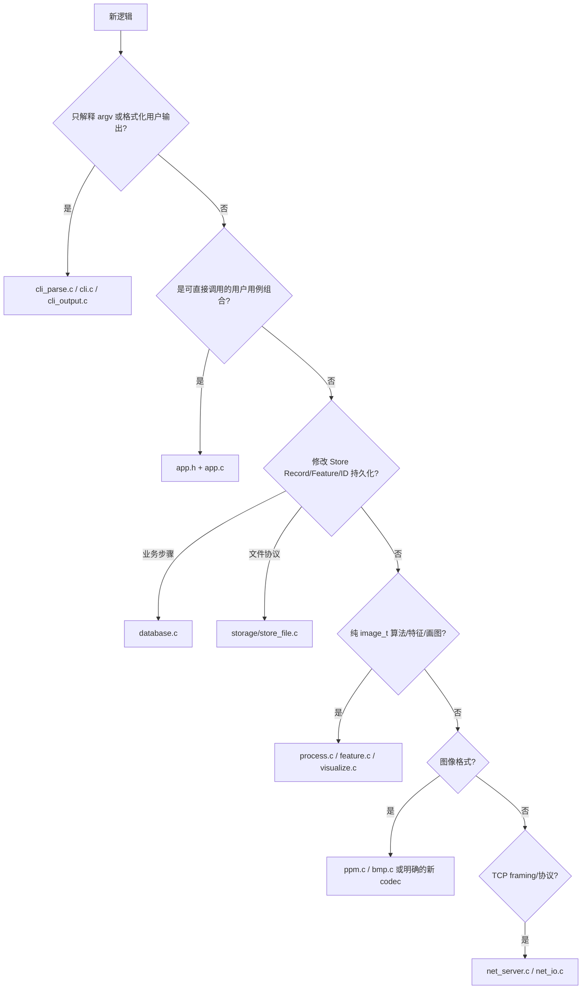

# C-ImageDB 模块维护指南

本文回答四个维护问题：文件各自负责什么、哪些文件要一起改、新逻辑应放在哪里、哪些依赖不应出现。接口签名以当前头文件为准。

## 1. 仓库目录

| 路径 | 职责 | 维护注意事项 |
| --- | --- | --- |
| `include/` | 对多个生产模块或外部调用者有意义的公共 C 接口 | 不要把仅 CLI/Store 内部使用的 helper 暴露到这里 |
| `src/` | 生产实现、两个前端、内部头文件 | `app.c` 是 CLI 核心用例边界，不是所有模块的公共入口 |
| `src/storage/` | Store 元数据、Feature 和 ID 文件的内部持久化实现 | `store_file.h` 故意不在 `include/` |
| `tests/` | C 单元测试、Shell CLI 集成测试、Python TCP 协议测试、旧格式 fixture | 多数集成脚本会删除或重建 `data/`、`output/` |
| `scripts/` | 开发者统一构建/测试入口、样例生成和 demo | `build.sh`、`test.sh` 应与 Makefile 保持一致 |
| `samples/` | 可重复演示和测试用的 PPM/BMP 样例 | 不要把运行期临时图像写入这里 |
| `bench/` | 端到端 benchmark 脚本和结果 | benchmark 是性能烟雾测试，不等于稳定性能承诺 |
| `docs/` | 设计、演示、发布、维护者文档 | 历史学习材料可能含拆分前函数名和行号 |
| `.github/workflows/` | CI | 当前调用本地相同的 Make/script 入口 |

运行时目录 `data/`、`output/` 不是源码模块。`data/` 是 Store；`output/` 是用户产物。二者都可能被测试重建。

### 1.1 根目录主要文件

| 文件 | 职责 |
| --- | --- |
| `Makefile` | 定义共享 engine、CLI/server 前端、依赖文件、构建 profile 和测试目标 |
| `README.md` | 用户功能、CLI、当前模块目录、构建和测试概览 |
| `CONTEXT.md` | Image、Record、Feature、Store 等领域词汇与既有设计约束 |
| `.clang-format` | C/C header 的格式规则；不代表应全量格式化历史代码 |
| `.gitignore` | 构建产物、运行时 Store/output 和测试临时产物的忽略规则 |
| `.github/workflows/ci.yml` | 严格构建、测试、benchmark 和 sanitizer 的 CI 编排 |
| `LICENSE` | 项目许可证 |

## 2. 公共头文件

### 2.1 `include/common.h`

定义跨模块边界常量：`MAX_NAME_LEN`、`MAX_PATH_LEN`、`MAX_CMDLINE`、`MAX_IMAGE_WIDTH`、`MAX_IMAGE_HEIGHT`、`MAX_IMAGE_PIXELS`。只有真正跨模块且语义稳定的限制才应放这里；不要把 Store 文件名、CLI 命令名或网络响应文本放入 common。

### 2.2 `include/image.h`

公共类型 `image_t` 和接口：

- `image_create()`：返回 owned `image_t *` 或 `NULL`。
- `image_destroy()`：释放结构体与像素缓冲区。
- `image_clone()`：返回独立 owned 副本。
- `image_valid()`：验证尺寸、三通道和缓冲区。

修改它通常要同时检查 `src/image.c`、`src/ppm.c`、`src/bmp.c`、`src/process.c`、`src/feature.c`、`src/visualize.c` 和 `tests/test_core.c`。

### 2.3 `include/ppm.h` 与 `include/bmp.h`

- `ppm_read()`/`bmp_read()`：从文件构造 owned `image_t *`。
- `ppm_write()`/`bmp_write()`：借用 `image_t`，返回 0/-1。

格式解析变化必须增加或更新 `tests/test_core.c` 及相关 CLI 集成测试。不要让 codec 依赖 Store Record 或 CLI 输出文案。

### 2.4 `include/feature.h`

定义 `image_feature_t`、`feature_extract_rgb_hist()`、三种度量函数。`feature_print_summary()` 和 `feature_print_full()` 仍是公共且直接写 stdout 的历史接口；`app.c` 不使用它们。若要收窄这两个接口，应先确认是否存在仓库外调用者。

### 2.5 `include/database.h`

定义磁盘 Record 的内存模型 `image_record_t`，以及 Store 业务门面：

- 初始化/ID：`db_init()`、`db_next_id()`。
- Record：`db_add_record()`、`db_load_records()`、`db_find_record_by_id()`、`db_mark_deleted()`。
- Feature：`db_add_feature()`、`db_load_features()`、`db_find_feature_by_id()`。
- 完整替换：`db_write_records()`、`db_write_features()`、`db_replace_store()`。
- 组合操作：`db_commit_import()`、`db_compact()`。

`db_load_*()` 成功返回的数组由调用者 `free()`。改变 `image_record_t` 或 `image_feature_t` 会直接改变原生磁盘布局，是兼容性变更，不能作为普通重构执行。

### 2.6 `include/process.h`

所有 `process_*()` 借用源 `image_t`，成功时返回新的 owned `image_t`，失败返回 `NULL`。算法应独立于路径、Store、CLI 和网络。

### 2.7 `include/search.h` 与 `include/similarity.h`

`search_similar()` 接受 Store Record ID、Top-K 和 `search_metric_t`，返回 owned `search_result_t[]`。

`similarity_search_ppm()` 接受外部 PPM 路径和 Top-K，返回 owned `similar_image_result_t[]`，并使用 `similarity_status_t` 区分错误。不要把两者机械合并：它们的查询来源、支持 metric、错误码和稳定排序行为不同。

### 2.8 `include/app.h`

这是“可直接测试的核心业务”接口，而不是磁盘格式：

- `app_command_kind_t`、query field/operator 描述结构化命令。
- `app_command_t` 的字符串字段为调用期间借用。
- `app_context_t` 当前只携带借用的 `data_dir`。
- `app_status_t` 是 CLI 用例层状态。
- `app_result_t` 是带 kind 的结果联合体。
- `app_execute()` 不解析 argv、不读写终端。
- `app_result_destroy()` 释放成功或部分失败结果中的 owned 载荷。

增加 CLI 命令通常必须同步更新 `include/app.h`、`src/cli_parse.c`、`src/app.c`、`src/cli.c`、`tests/test_cli_parse.c`、`tests/test_app.c` 和 CLI 兼容测试。

### 2.9 其他公共接口

- `include/verify.h`：`verify_database()`、`repair_database()` 及两个 summary；`verify_print_summary()`/`repair_print_summary()` 是仍直接输出的历史接口。
- `include/visualize.h`：返回 owned 直方图图像/contact sheet。
- `include/report.h`：结构化 `report_status_t` 和兼容的 0/-1 wrapper。
- `include/cli.h`：`cli_run()`、`cli_print_help()`。
- `include/net_io.h`：`net_send_all_with()` 可注入 send 回调，`net_send_all()` 使用系统 `send()`。
- `include/net_server.h`：`net_server_run(port)`。

## 3. 实现文件

### 3.1 CLI 与应用层

| 文件 | 当前职责 | 不应放入 |
| --- | --- | --- |
| `src/main.c` | CLI `main()`，转交 `cli_run()` | 参数细节、业务、I/O |
| `src/cli_parse.c` / `.h` | argv 解析、参数范围和 query 组合校验、结构化解析错误 | `db_*()`、`fopen()`、`printf()` |
| `src/cli.c` | CLI 编排、用户可见错误/成功文本、退出码、帮助 | Store 序列化、图像算法 |
| `src/cli_output.c` / `.h` | 用户指定的图像和 CSV 输出；CSV 使用临时文件替换，图像委托 codec 直接写目标 | Store metadata/features 写入、业务过滤 |
| `src/app.c` | 用例分发、导入、查询、统计、处理、检索、可视化组合 | argv 解析、用户文案、TCP 协议 |

`src/app.c` 仍直接包含 `copy_file()`、`get_file_size()` 和导入目标路径拼装；这是已知边界债，但不要在修改 query/index/CLI 时顺手迁移。

### 3.2 数据与 Store

| 文件 | 当前职责 | 不应放入 |
| --- | --- | --- |
| `src/database.c` | 基于完整数组的查找/修改/过滤，以及导入/compact 业务步骤 | `FILE *`、tmp/bak 具体文件协议、CLI 文本 |
| `src/storage/store_file.c` / `.h` | 路径创建、目录初始化、原生结构体数组读写、`.next_id`、replace/rollback | query/search、图像算法、用户输出 |

函数调用方向是 `database.c → store_file.c`；但 `store_file.h` 包含 `database.h` 以取得 `image_record_t` 和间接取得 `image_feature_t`，因此模块间还存在 `storage → database` 的编译期类型依赖。Storage 没有反向调用 `db_*()`。若未来要降低这项类型耦合，应先定义磁盘兼容策略，而不是复制结构体或制造一组一一转发接口。

### 3.3 图像与检索

| 文件 | 当前职责 |
| --- | --- |
| `src/image.c` | `image_t` 分配、销毁、克隆、有效性 |
| `src/ppm.c` | P6 token/header/raster 解析和写入 |
| `src/bmp.c` | packed header、24-bit BI_RGB、行 padding、BGR/RGB、bottom-up |
| `src/process.c` | 灰度、二值、均值模糊、Sobel、缩放、旋转、均衡、中值、高斯、亮度/对比度 |
| `src/feature.c` | RGB histogram、均值和三种度量；另有历史 stdout helper |
| `src/search.c` | Store ID 查询、三种 metric、删除过滤、排序和 Top-K |
| `src/similarity.c` | 外部 PPM 查询、L1、Store 顺序 tie-break |
| `src/visualize.c` | 直方图画布和横向 contact sheet |

这里暂不需要 `index/`：没有独立索引结构或生命周期。只有在出现真实的持久化/内存索引，并且有明确更新与兼容规则时，才应建立该模块。

### 3.4 校验、报告与网络

| 文件 | 当前职责 |
| --- | --- |
| `src/verify.c` | Store 一致性分析和修复，使用 Store 接口与 codec |
| `src/report.c` | CSV 解析、HTML escaping、报告文件写入 |
| `src/server_main.c` | 端口参数解析和服务启动 |
| `src/net_server.c` | socket 生命周期、行 framing、TCP 命令解析、协议文本、直接查询 |
| `src/net_io.c` | 发送全部字节，处理短写与 `EINTR` |

`net_server.c` 当前不经过 `app_execute()`。协议兼容性比消除这条依赖更重要；若要统一用例，必须先为每条网络响应建立字节级回归测试。

## 4. 哪些文件通常一起修改

### 4.1 新增或调整 CLI 命令

最小联动集合：

1. `include/app.h`：命令 kind、参数、状态或结果。
2. `src/cli_parse.c`：参数到命令的转换。
3. `src/app.c`：结构化用例。
4. `src/cli.c`：帮助、成功/错误呈现和退出码。
5. 需要用户文件时才修改 `src/cli_output.c`。
6. `tests/test_cli_parse.c`、`tests/test_app.c`、`tests/run_cli_compat_tests.sh` 和相应功能脚本。

不要只在 `cli.c` 中直接调用 `db_*()` 实现新命令，否则会重新耦合解析、业务和呈现。

### 4.2 修改 Store 格式或提交规则

至少一起检查：

- `include/database.h` 的 `image_record_t`；
- `include/feature.h` 的 `image_feature_t`；
- `src/database.c`；
- `src/storage/store_file.c/.h`；
- `tests/test_store.c`；
- `tests/run_storage_tests.sh`；
- `tests/fixtures/storage-v1-lp64/`；
- `docs/architecture.md` 的磁盘格式说明。

这类修改不是普通重构。需要版本标识、迁移/回滚方案和旧文件 fixture 后才可执行。

### 4.3 修改 PPM/BMP 支持

- PPM：`include/ppm.h`、`src/ppm.c`、`tests/test_core.c`、`tests/run_basic_tests.sh`。
- BMP：`include/bmp.h`、`src/bmp.c`、`tests/run_basic_tests.sh`，必要时 `tests/run_image_ops_tests.sh`。
- 若改变 import 的格式选择，再检查 `src/app.c::read_image_file()` 和 CLI 兼容文本。

### 4.4 修改算法或检索

- 单个处理算法：`include/process.h`、`src/process.c`、`tests/test_core.c`、`tests/run_image_ops_tests.sh`。
- Feature/metric：`include/feature.h`、`src/feature.c`、`src/search.c`、`src/similarity.c` 和检索测试。
- 排序/Top-K：`src/search.c` 或 `src/similarity.c`，并保留 `tests/search_similar_test.sh` 的 stable ordering 与 metric 断言。

### 4.5 修改 TCP 协议

一起修改 `src/net_server.c`、必要时 `src/net_io.c`、`tests/net_protocol_test.py` 和 `tests/run_net_tests.sh`。用户可见协议文本、换行、连接关闭语义都是兼容接口。

### 4.6 修改构建或测试入口

一起核对 `Makefile`、`scripts/build.sh`、`scripts/test.sh` 和 `.github/workflows/ci.yml`。CI 必须调用本地已验证的相同命令。

## 5. 新功能放置规则

具体原则：

- 新业务应先有结构化输入/结果，再由 CLI 适配。
- Store 路径和 metadata/features 序列化放 storage；用户导出文件放 output/report/codec。
- 只有两个以上调用者真实共享、且语义一致的 helper 才进入 common。
- 不要为了目录整齐创建只转发一次调用的 service/repository/factory。

## 6. 禁止的依赖方向

以下依赖会破坏当前边界：

- `database.c` 或 `store_file.c` → `cli.c`/`cli_parse.c`/`printf` 用户文本。
- `process.c`/`feature.c`/`image.c` → `database.h`、Store 路径或网络。
- `cli_parse.c` → `database.h`、codec、文件系统。
- `store_file.c` → `app.h`、search、verify、report。
- `net_io.c` → Store 或协议命令。
- 公共 `include/*.h` → `src/*.h` 内部头文件。
- 测试 helper → 生产代码中的条件编译捷径，除非有明确、最小的可测试 seam。

当前 `net_server.c → database/search` 是已知例外，不表示其他前端也应绕过应用边界。

## 7. 测试与模块映射

| 测试 | 主要覆盖 |
| --- | --- |
| `tests/test_core.c` | PPM parser、`image_t` 边界、1×1 处理算法 |
| `tests/test_net_io.c` | short write、`EINTR` 和发送失败 |
| `tests/test_store.c` | 空 Store、创建、round-trip、截断/损坏、边界字段、写失败、成对替换 |
| `tests/test_cli_parse.c` | 结构化命令、借用路径、metric、query、解析错误 |
| `tests/test_app.c` | 无 CLI 的 Store 用例、处理结果、query、结构化错误/无输出 |
| `tests/run_basic_tests.sh` | 主 CLI 功能与大量输入/格式边界 |
| `tests/run_db_tests.sh` | find/query/stats/export/compact |
| `tests/run_image_ops_tests.sh` | 增强处理算法和错误路径 |
| `tests/run_visual_tests.sh` | histogram/search CSV、hist image、contact sheet |
| `tests/run_storage_tests.sh` | 持久化重启、旧 v1 fixture、路径安全、回滚、CSV 原子替换 |
| `tests/run_cli_compat_tests.sh` | 精确 stdout/stderr/退出码兼容性 |
| `tests/search_similar_test.sh` | 外部 PPM、L1、stable ordering、空库/坏输入 |
| `tests/report_test.sh` | 报告内容、缺目录、畸形 CSV |
| `tests/verify_repair_test.sh` | 一致性发现、可修复项、遗留问题退出码 |
| `tests/net_protocol_test.py` | TCP framing、协议命令和错误文本 |

## 8. 不建议拆分或抽象的代码

- `image_t` 的四个基本生命周期函数：接口已经小而完整。
- `ppm.c` 和 `bmp.c`：两种格式的边界和字节规则不同，不应通过通用 codec 框架强行统一。
- `process.c` 的独立纯函数：虽然文件较长，但共享的是同一简单 `image_t` 契约；按每个算法建目录/对象只会增加导航成本。
- `net_io.c`：当前 seam 已足够测试短写和 `EINTR`，无需再包装 socket 对象。
- `store_file.c` 的 tmp/bak 提交流程：在没有新磁盘协议前应保持集中，拆散会使回滚更难审查。
- `search.c` 与 `similarity.c`：在统一查询语义之前不要合并；它们的 metric 和输入契约不同。
- 所有返回码不要一次性改成统一大枚举。当前错误体系不一致是技术债，但跨模块改动会直接影响错误文本和退出行为。
