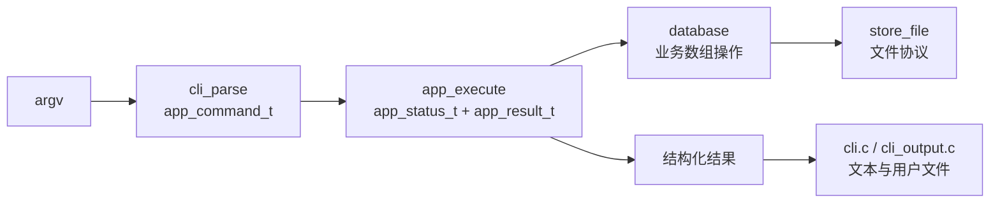

# C-ImageDB 渐进式整理记录

本文记录当前工作区可由代码和测试直接确认的工程化整理结果。它不是完整 Git 提交历史，也不声称未在当前代码中出现的工作。重构前后判断来自当前实现与仓库 `HEAD`/历史文档的对照；真实行为以现有测试为准。

## 1. 整理前的主要问题

### 1.1 CLI 文件职责混杂

拆分前的 `src/cli.c` 同时承担 argv 解析、参数错误文本、导入与查询业务、Store 调用、图像/CSV 写出和结果打印。业务只能通过进程级 CLI 间接测试，核心操作隐式依赖 `printf()` 和命令行字符串。

### 1.2 Store 规则与 `FILE *` 混在 Store 业务门面

拆分前的 `src/database.c` 同时决定逻辑删除/compact 等业务步骤，也直接构造路径、打开文件、序列化原生结构体数组和执行 tmp + rename。资源生命周期和错误点难以在接口层说明。

### 1.3 行为基线偏重端到端测试

原有 Shell 测试能覆盖大量真实命令，但缺少可直接调用的 parser、应用用例和 Store 故障测试。修改内部边界时，很难区分“结构变化”与“用户行为变化”。

### 1.4 构建入口缺少分层说明

共享引擎、CLI 前端和 server 前端的源文件关系不够醒目；Debug/Release/strict、单元/集成/Sanitizer 的统一入口也不够明确。

## 2. 当前已经完成的整理

### 2.1 CLI 解析、应用用例和输出分离

当前职责为：

- `src/cli_parse.c/.h`：把 argv 转为 `app_command_t` 和 `cli_parse_error_t`。
- `include/app.h`、`src/app.c`：通过 `app_execute()` 执行结构化命令，通过 `app_status_t`/`app_result_t` 返回结果。
- `src/cli_output.c/.h`：写用户请求的图像和 CSV。
- `src/cli.c`：保留帮助、用户文本、退出码和前端编排。
- `src/main.c`：只调用 `cli_run()`。

`tests/test_cli_parse.c` 锁定参数到结构化命令的转换；`tests/test_app.c` 证明 Store workflow、处理、query 和错误可在不启动 CLI 的情况下调用；`tests/run_cli_compat_tests.sh` 锁定精确 stdout/stderr 与退出码。

### 2.2 Store 文件 I/O 集中

当前 `src/storage/store_file.c/.h` 统一处理：

- Store 目录和文件初始化；
- `.next_id` 文本读取、推进和临时替换；
- `image_record_t[]` 与 `image_feature_t[]` 的原生布局读写；
- 单文件完整替换；
- metadata/features 成对 tmp/bak 安装与运行时回滚；
- Record 字符串和 Store 本地路径校验。

`src/database.c` 现在主要是 Store 业务门面：加载、查找、逻辑删除、导入数组扩展、compact 过滤，再调用 storage 替换。

`tests/test_store.c` 覆盖创建、空 Store、缺失/不可读、ID 持久化、round-trip、重复写、边界长度、损坏/截断、成对替换和写失败；`tests/run_storage_tests.sh` 还覆盖重启读取、路径安全、回滚和 `storage-v1-lp64` 旧文件 fixture。

### 2.3 工程化构建入口

当前 `Makefile` 明确区分 `ENGINE_SRC`、`CLI_SRC`、`SERVER_SRC`，并提供：

- `debug`、`release`、`strict`；
- `test-unit`、`test-integration`、`test`；
- `benchmark-test`、`sanitizer-test`。

`scripts/build.sh` 和 `scripts/test.sh` 是薄封装；`.github/workflows/ci.yml` 调用与本地一致的 Make/脚本命令；`.clang-format` 只提供格式规则，没有对历史文件做全量格式化。

## 3. 为什么这样拆分

### 3.1 以真实变化原因建立边界

CLI 文本/参数、业务规则、Store 文件格式、图像算法的变化原因不同。现在每层通过一个小而明确的契约连接：

这不是把项目改写成新架构，而是在原调用链中插入可测试 seam。现有 C 技术栈、数据结构和函数式处理接口保持不变。

### 3.2 内部接口不扩大公共面

只有需要作为应用边界的 `app.h` 放在 `include/`。`cli_parse.h`、`cli_output.h`、`store_file.h` 保留在 `src/`，避免把实现细节误当成长期公共 API。

### 3.3 不把所有 I/O 合并成一个模块

Store 的 metadata/features/ID I/O 集中到 storage，但 codec 仍负责图像格式，CLI output 仍负责用户 CSV/图像，report 仍负责 HTML。它们的格式、所有权和调用者不同，合并只会形成新的大模块。

## 4. 刻意保持不变的行为

整理过程中需要持续保持：

- `imagedb` 与 `cimagedb` 的命令、参数、帮助和用户可见输出；
- CLI 正常/错误的 stdout、stderr 和 0/1 退出行为；
- `imagedb-server` 的 LIST/INFO/SEARCH/QUIT 协议文本和串行模型；
- `metadata.dat` 的 `image_record_t[]` 原生布局；
- `features.dat` 的 `image_feature_t[]` 原生布局；
- `.next_id` 的十进制文本格式；
- `data/images/<id>.ppm|.bmp` 的原始文件副本；
- PPM P6 与 24-bit BI_RGB BMP 的既有限制；
- 像素哈希去重、逻辑删除、compact 和三种检索 metric；
- 失败导入可能消耗 ID 的行为；
- 双文件 POSIX rename 之间仍存在 crash window；
- C11、Make、Shell/Python 测试的技术栈，不新增运行时第三方依赖。

## 5. 当前仍存在的技术债

### 高风险/需要规格先行

1. **原生结构体磁盘格式**：受字节序、padding、`long` 宽度和 ABI 影响。任何改变都需版本格式和迁移工具。
2. **并发写入无锁**：`.next_id`、完整数组替换和双文件提交都没有进程间锁。
3. **崩溃/断电保证有限**：没有 `fsync()`；`store_file_replace_store()` 两次安装 rename 之间有窗口。
4. **TCP 前端绕过应用边界**：`net_server.c` 直接调用 database/search，并有独立硬编码 `DATA_DIR`。迁移可能改变协议错误文本和边界行为。

### 中风险/可渐进处理

1. **`src/app.c` 仍较长**：导入、query、stats、可视化组合都在同一分发模块。拆分应按一个完整用例逐步迁移，而不是按行数机械切文件。
2. **`src/cli.c` 仍较长**：大量历史成功/错误文本必须精确兼容；可按输出领域提取纯格式化 helper，但要先补字节级测试。
3. **导入文件 I/O 尚在应用层**：`copy_file()`、`stat()`、具体 `data/images` 路径拼装和失败 `unlink()` 位于 `app.c`。
4. **检索存在重复全表加载**：`search.c::is_deleted()` 在候选循环内重复 `db_load_records()`，尽管外层已加载 Record。
5. **错误体系不统一**：模块分别使用 0/-1、NULL、`similarity_status_t`、`report_status_t`、`app_status_t`。
6. **历史 stdout 接口**：`feature_print_*()`、`verify_print_summary()`、`repair_print_summary()` 仍把输出副作用暴露为公共 API。

### 低风险/可选优化

1. `store_file_init()` 除 Store 外还创建当前目录的 `output/`，职责边界不纯。
2. Report 由 `app_execute()` 直接调用且自行写 HTML，结构化程度低于其他输出。
3. 数据操作全量加载和全量重写，适合当前小规模，但扩展性有限。
4. TCP 服务一次只服务一个客户端，没有关闭信号或优雅退出入口。

## 6. 下一步不建议自动执行的重构

以下工作都需要单独设计、明确确认和专用回归基线，不能作为“顺手整理”：

- 给磁盘格式加版本头、改成固定宽度字段或迁移到新序列化；这会触及兼容文件和外部 API。
- 让 TCP 服务直接复用 `app_execute()`；必须先锁定每条协议响应、错误映射和连接语义。
- 把 codec、report、CLI output 的全部 `FILE *` 都迁入 Store storage；这些不是同一种持久化职责。
- 一次性统一所有错误码、重命名所有公共函数或删除兼容 wrapper。
- 仅为了缩短文件而机械拆分 `app.c`/`cli.c`，或引入 service/repository/factory 对象层。
- 合并 `search.c` 与 `similarity.c`；两者查询来源、metric 和 tie-break 契约不同。
- 优化检索加载/排序但不先补充结果顺序、deleted 过滤和 metric 的回归测试。
- 为了“现代化”换 CMake、C++、外部数据库、图像框架或 CLI 框架。

## 7. 验证与回滚原则

每个后续阶段应只覆盖一个明确边界，并保持独立构建和运行：

1. 修改前记录当前问题、文件范围、风险和验证命令。
2. 高风险行为先补最小回归测试。
3. 迁移一个用例/模块，避免同时动 CLI、Store、search 和协议。
4. 执行 Release/strict 构建、相关单测、完整集成测试和必要 Sanitizer。
5. 用 `git diff --check`、`git diff --stat` 和行为清单确认范围。
6. 回滚时按该阶段的文件集合撤销，不依赖破坏性 `git reset` 或清理用户改动。

当前最可靠的兼容锚点是 `tests/run_cli_compat_tests.sh`、`tests/test_app.c`、`tests/test_store.c`、`tests/run_storage_tests.sh`、`tests/search_similar_test.sh` 和 `tests/net_protocol_test.py`。

## 8. 历史文档使用提醒

`README.md` 的模块目录和单元测试清单已经与当前拆分同步。`docs/LEARNING_PLAN.md`、`docs/STUDY_GUIDE.md`、`docs/project_interview_notes.md` 中仍有拆分前描述和固定行号；维护调用链时请优先使用本文、`docs/architecture.md`、`docs/code-walkthrough.md` 和当前源码。
